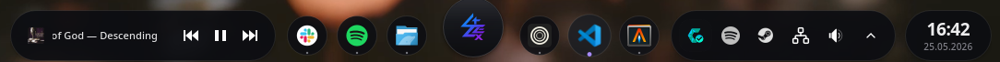
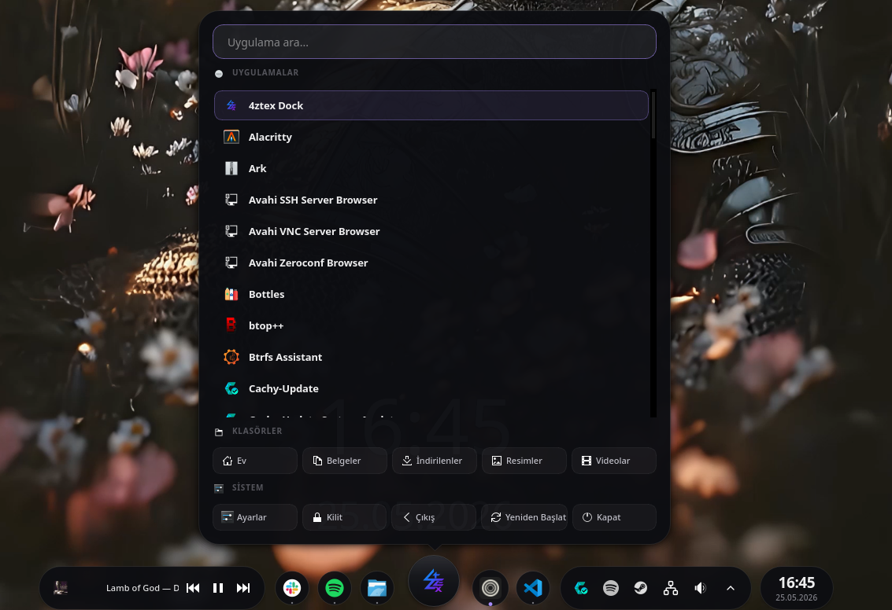
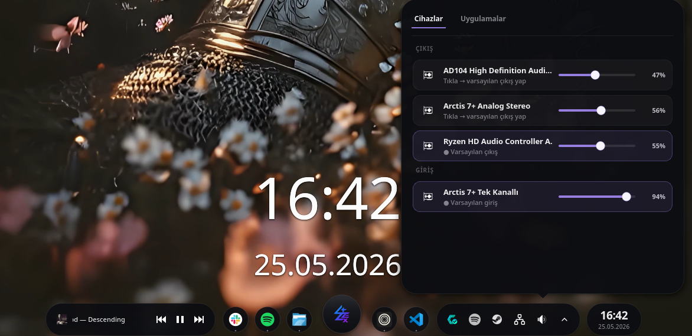
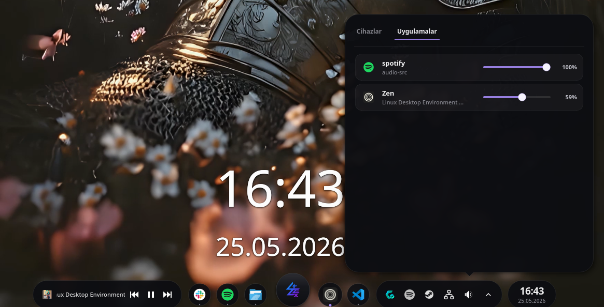
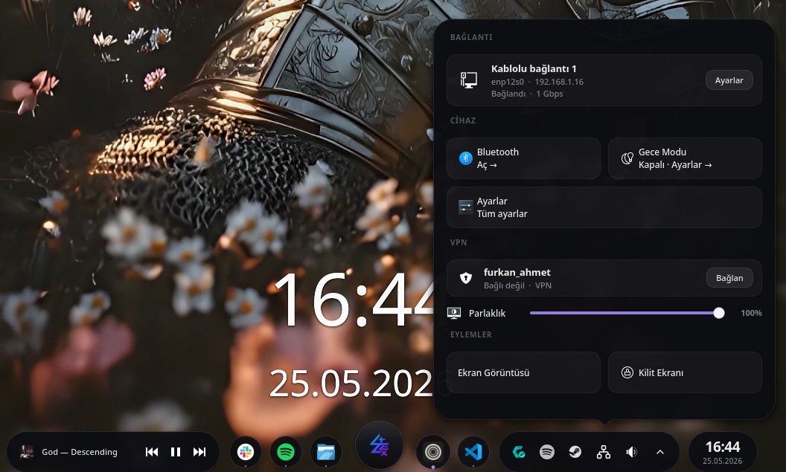
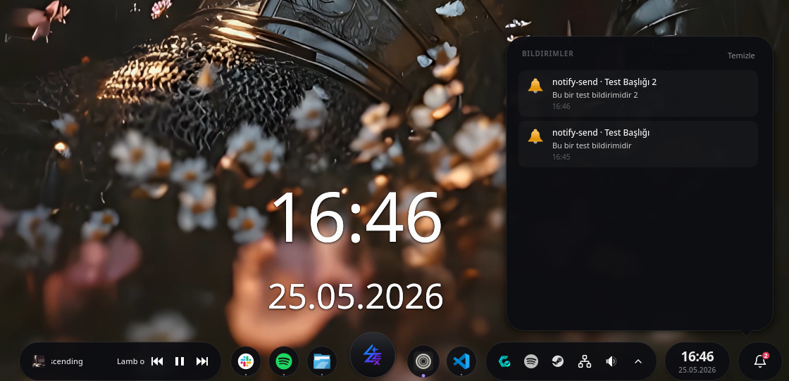
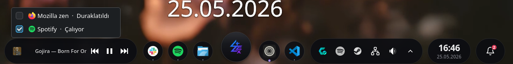
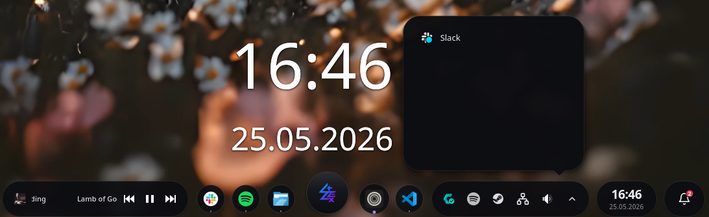

# 4ztexDock

> A Wayland layer-shell taskbar / launcher / dock for KDE Plasma 5 & 6.

[](https://aur.archlinux.org/packages/4ztexdock-git)
[](https://aur.archlinux.org/packages/4ztexdock-git)
[](LICENSE)
[](https://github.com/furkann-ahmet/4ztexDock/actions/workflows/ci.yml)

**Languages:** [Türkçe](README.tr.md) · **English**

4ztexDock is a custom dock built to replace KDE Plasma's default panel. It
brings together pinned launchers, an open-windows task list, audio / network /
notification panels, the system tray, the clock and a global launcher menu —
all inside a single layer-shell window.



> 🌀 **Vibecoded**: this project was built largely through vibecoding with an
> LLM (Claude). From architectural decisions down to per-panel implementations,
> almost every line went through AI-assisted iteration. The code has been
> reviewed and tested, but treat it as experimental software. Bug reports and
> fix PRs are very welcome.

---

## Features

**Launcher menu** — Shows your most-launched apps in a 4×2 grid, sorted by
usage frequency via LaunchTracker. Search box at the top, full keyboard
navigation with the arrow keys + Enter/Esc, folder shortcuts and session
actions (log out, restart, shut down) at the bottom. Press **Meta** to open
it from anywhere.



**Audio panel** — Two tabs: output/input devices and audio-producing apps.
Driven by `pactl`, so PipeWire and PulseAudio both work the same way. For
anonymous sink-inputs (think `media.name="audio-src"`), the dock looks up
client-level metadata — flatpak `app_id` plus the actual host PID — so
Spotify, Discord and browser Web Audio tabs all show up with the correct name
and icon even when they don't advertise themselves directly.




**Network panel** — Card shape adapts to the active connection type (Ethernet,
Wi-Fi, or VPN). Below it: a brightness slider tied to KDE's Solid
PowerManagement DBus, a list of VPNs from `nmcli`, and quick-action tiles for
lock, screenshot, night mode, Bluetooth and settings.



**Notification server** — The dock registers `org.freedesktop.Notifications`
itself. Every notification — from Slack, Discord, `notify-send`, libnotify —
goes straight to its notification panel. If another daemon (Plasma's own,
dunst, mako…) already owns the name, the dock politely steps aside instead
of fighting for it.



**Now Playing module** — Pick which MPRIS player (Spotify, Mozilla, VLC…) to
control with one click, then play / pause / skip directly from the dock.



**System tray** — Hosts every tray icon on the system via
`org.kde.StatusNotifierWatcher`. Anything that doesn't fit ends up in the
overflow popup; right-click context menus work in both places.



**More**: CPU/RAM usage + network throughput widget, the full KWin task list
(workspace-filtered), drag-to-reorder for task buttons, and a pulse animation
on the button when its window minimizes.

---

## Compatibility

| Environment                     | Status      | Notes                                                                 |
| ------------------------------- | ----------- | --------------------------------------------------------------------- |
| KDE Plasma 6 (Wayland)          | ✅ Full     | Primary target. Layer-shell + KWin scripting + ScreenShot2.           |
| KDE Plasma 6 (X11)              | ✅ Full †   | `_NET_WM_WINDOW_TYPE_DOCK` + `_NET_WM_STRUT_PARTIAL` dock window.     |
| KDE Plasma 5 (X11/Wayland)      | ✅ Full * † | *No window-preview thumbnails (no ScreenShot2 DBus in Plasma 5); icon + title fallback. |
| GNOME / Hyprland / sway         | ⚠️ Partial  | Audio + network + notifications work; task list does not (no KWin).   |

> **† Untested in CI / on real systems.** Plasma 6 X11 and Plasma 5 paths are
> implemented and code-validated but have not been verified on real hardware
> by the maintainer. Bug reports very welcome — see `Bug report` section in
> CONTRIBUTING.md.

The dock auto-detects the session type and Plasma version at startup: it uses
the layer-shell protocol on Wayland and EWMH dock window setup on X11, and
handles the Plasma 5 vs 6 KWin scripting API differences with a dual-API JS
bridge. If the `org.kde.KWin` DBus service isn't available at all, it exits
early.

---

## Installation

### Requirements

- **KDE Plasma 6** (recommended) or **KDE Plasma 5** (untested, risky)
- **Wayland** or **X11** session
- **Qt 6.6+** (private headers used; older may fail to build)
- **PipeWire / PulseAudio** (audio panel — if missing, panel disabled, dock still runs)
- **NetworkManager** (network panel — if missing, panel disabled, dock still runs)

---

### Path 1 — Arch Linux (easiest, package-managed)

**From AUR (stable):**

```sh
yay -S 4ztexdock-git
```

Or manually:

```sh
git clone https://aur.archlinux.org/4ztexdock-git.git
cd 4ztexdock-git
makepkg -si
```

**From local repo (for source changes):**

```sh
git clone https://github.com/furkann-ahmet/4ztexDock.git
cd 4ztexDock/packaging
makepkg -si
```

The package installs:

| Location | What |
|---|---|
| `/usr/bin/4ztexDock` | Binary |
| `/usr/share/4ztexDock/style/dock.qss` | Stylesheet |
| `/usr/share/applications/com.4ztex.dock.desktop` | App menu entry |
| `/etc/xdg/autostart/com.4ztex.dock.desktop` | Plasma login auto-launch |
| `/usr/share/icons/hicolor/scalable/apps/4ztex-icon.svg` | Hicolor icon |
| `/usr/share/licenses/4ztexdock/LICENSE` | GPL-3.0 |
| `/usr/share/doc/4ztexdock/config.ini.example` | Config sample |

---

### Path 2 — Other distros (`install.sh --install-deps`)

`install.sh` reads `/etc/os-release` to detect the distro, installs deps via
apt/dnf/zypper/pacman, builds, and installs the files.

```sh
git clone https://github.com/furkann-ahmet/4ztexDock.git
cd 4ztexDock
sudo ./install.sh --install-deps --system
```

This single command:

1. Detects distro (`/etc/os-release` ID)
2. Installs build + runtime deps (Qt6, layer-shell-qt, xcb-ewmh, NetworkManager, PipeWire, gcc, make)
3. Compiles translations (`lrelease6`, `.ts` → `.qm`)
4. Builds via `qmake6` + `make -j$(nproc)`
5. Installs under `/usr/local` (binary, qss, icons, .desktop, autostart, LICENSE, config sample)
6. Refreshes KDE service cache (`kbuildsycoca`)
7. Restarts running dock if any

**Supported distros** (package names baked into the script):

| Family | Distros |
|---|---|
| Arch | Arch, CachyOS, EndeavourOS, Manjaro, ArcoLinux |
| Debian | Debian, Ubuntu, Pop!_OS, Linux Mint, elementary, Kali, Raspbian |
| Fedora | Fedora, RHEL, CentOS, Rocky, AlmaLinux, Nobara |
| openSUSE | Tumbleweed, Leap |

**User-local install** (no sudo; deps must already be present):

```sh
./install.sh --user
# binary  → ~/.local/bin/4ztexDock
# config  → ~/.config/autostart/com.4ztex.dock.desktop
```

In user mode, if `~/.local/bin` isn't in PATH, the script warns; add to your
shell rc:

```sh
export PATH="$HOME/.local/bin:$PATH"
```

**Help:**

```sh
./install.sh --help
```

---

### Path 3 — Install deps manually, then install.sh

If you don't want `--install-deps` (e.g. you want specific package versions),
install deps yourself, then build/install:

**Debian / Ubuntu:**

```sh
sudo apt update
sudo apt install --no-install-recommends \
    qmake6 qt6-base-dev qt6-wayland-dev qt6-l10n-tools \
    layer-shell-qt-dev libxkbcommon-dev libwayland-dev \
    libxcb1-dev libxcb-ewmh-dev \
    network-manager pipewire-pulse \
    build-essential pkg-config
```

> ⚠️ On Ubuntu < 24.04, `layer-shell-qt-dev` is missing.
> Use `sudo add-apt-repository ppa:kubuntu-ppa/backports` or build from source.

**Fedora / RHEL / Rocky / AlmaLinux / Nobara:**

```sh
sudo dnf install -y \
    qt6-qtbase-devel qt6-qtwayland-devel qt6-qttools-devel \
    layer-shell-qt-devel libxkbcommon-devel wayland-devel \
    libxcb-devel xcb-util-wm-devel \
    NetworkManager pipewire-pulseaudio \
    gcc-c++ make pkgconf
```

**openSUSE (Tumbleweed/Leap):**

```sh
sudo zypper install -y \
    qt6-base-devel qt6-wayland-devel qt6-tools-linguist \
    layer-shell-qt-devel libxkbcommon-devel wayland-devel \
    libxcb-devel xcb-util-wm-devel \
    NetworkManager pipewire-pulseaudio \
    gcc-c++ make pkgconf
```

Then build + install:

```sh
git clone https://github.com/furkann-ahmet/4ztexDock.git
cd 4ztexDock
./install.sh --system        # to /usr/local (sudo)
# or
./install.sh --user          # to ~/.local (no sudo)
```

---

### Path 4 — Fully manual (no script)

If `install.sh` doesn't work or you want to see every step for debugging:

```sh
git clone https://github.com/furkann-ahmet/4ztexDock.git
cd 4ztexDock

# 1) Translations
lrelease6 translations/4ztexDock_tr.ts translations/4ztexDock_en.ts
#   (on Fedora it's lrelease-qt6, on openSUSE lrelease6)

# 2) Build
qmake6 4ztexDock.pro
make -j$(nproc)

# 3) Install (prefix = /usr/local)
PREFIX=/usr/local
sudo install -Dm755 4ztexDock                  "$PREFIX/bin/4ztexDock"
sudo install -Dm644 style/dock.qss             "$PREFIX/share/4ztexDock/style/dock.qss"
sudo install -Dm644 icons/4ztex-icon.svg       "$PREFIX/share/icons/hicolor/scalable/apps/4ztex-icon.svg"
for f in icons/*; do
    [ -f "$f" ] || continue
    sudo install -Dm644 "$f" "$PREFIX/bin/icons/$(basename "$f")"
done

# 4) .desktop + autostart
sed "s|@PREFIX@|$PREFIX|g" packaging/4ztexDock.desktop.in | \
    sudo tee /usr/share/applications/com.4ztex.dock.desktop > /dev/null
sudo cp /usr/share/applications/com.4ztex.dock.desktop \
        /etc/xdg/autostart/com.4ztex.dock.desktop

# 5) License + config sample
sudo install -Dm644 LICENSE                          "$PREFIX/share/licenses/4ztexdock/LICENSE"
sudo install -Dm644 packaging/config.ini.example     "$PREFIX/share/doc/4ztexdock/config.ini.example"

# 6) Refresh KDE cache
sudo kbuildsycoca6 --noincremental    # or kbuildsycoca5
sudo update-desktop-database -q /usr/share/applications
```

---

## After installation (do these or things will be broken)

The dock won't be fully functional until you've gone through these steps.

### 1. Remove Plasma's default panel

Right-click the default panel → **"Remove Panel"** (Plasma 6) or
**"Panel Settings → Remove This Panel"** (Plasma 5). If you skip this, both
panels will visually overlap at the bottom of the screen.

### 2. Log out and back in (required)

Three different things need this:

- **KWin's ScreenShot2 caller cache** — When the dock is launched via XDG
  autostart, Plasma places it into the right systemd scope
  (`app-com.4ztex.dock-*.scope`). KWin grants window-preview thumbnail
  permission by checking that scope; without it you'll fall back to an
  icon + title only view (still functional, just less polished).
- **KGlobalAccel Meta shortcut** — If Plasma's kicker already grabs Meta,
  you'll need to free it (see the next step).
- **KApplicationTrader cache** — Plasma needs to pick up the new `.desktop`
  entry, which it does at session start.

### 3. If Meta is bound to Plasma kicker, free it

```sh
kwriteconfig6 --file kglobalshortcutsrc \
    --group plasmashell \
    --key "activate application launcher" \
    "none,none,Activate Application Launcher"
```

Then logout/login. (On KDE 5, use `kwriteconfig5`.)

### 4. Verify install

```sh
# Is the dock running?
pgrep -af 4ztexDock

# Manual start (skip waiting for logout/login)
/usr/bin/4ztexDock &
# or user-mode
~/.local/bin/4ztexDock &

# CLI checks
4ztexDock --version    # → "4ztexDock 0.1.0"
4ztexDock --help       # → full help text

# Notification flow test
notify-send "hi" "dock notification test"
# → should appear in the dock's notifications panel
```

If Plasma's default panel is still showing, the dock may visually overlap.
Remove the Plasma panel.

### 5. (Optional) Config file

```sh
mkdir -p ~/.config/4ztexDock
cp /usr/local/share/doc/4ztexdock/config.ini.example ~/.config/4ztexDock/config.ini
$EDITOR ~/.config/4ztexDock/config.ini
# Set accent color, screen, frequent app limit
pkill -x 4ztexDock; 4ztexDock &; disown
```

---

## Configuration

### CLI

```sh
4ztexDock --help
4ztexDock --version
4ztexDock --screen DP-2     # pin to a specific screen
```

### Config file

Path: `~/.config/4ztexDock/config.ini` (XDG_CONFIG_HOME respected). A template
is installed at `/usr/share/doc/4ztexdock/config.ini.example`.

```ini
[Display]
screen=DP-3                ; connector name, manufacturer, model or serial

[Appearance]
accent=167,139,250         ; R,G,B  (violet-400 default)

[Launcher]
frequentLimit=8            ; frequent-apps grid size: 1..16
```

After editing, restart the dock: `pkill -x 4ztexDock; /usr/bin/4ztexDock &; disown`.

### Logging

Use `QT_LOGGING_RULES` env var for category-based log control:

```sh
QT_LOGGING_RULES="dock.preview=false" 4ztexDock          # silence a category
QT_LOGGING_RULES="dock.*=false" 4ztexDock                # silence all dock logs
QT_LOGGING_RULES="dock.*.debug=true" 4ztexDock           # enable debug
```

Categories: `dock.env`, `dock.notif`, `dock.preview`, `dock.security`.

### Stylesheet

`style/dock.qss` — in dev mode, live-reloaded via `QFileSystemWatcher`.
Installed copy: `/usr/share/4ztexDock/style/dock.qss` (root-owned, edit the
repo copy for dev iteration).

---

## Development

```sh
qmake6 4ztexDock.pro
make -j$(nproc)
./4ztexDock
```

For QSS work: edit `style/dock.qss` — auto-reloads. For C++ work, use
`dev-watch.sh` (entr-based auto build+restart).

Tests:

```sh
cd tests
qmake6 tests.pro
make -j$(nproc)
./run-all.sh
```

22 unit tests across `audio_parser_test` + `icons_test`.

---

## Troubleshooting

**"4ztexDock only runs under a Wayland or X11 session"** — Pick a "Plasma"
session on the login screen (either Wayland or X11).

**"org.kde.KWin DBus service not found"** — Either KWin hasn't started yet
(give Plasma a few seconds when launching manually) or you're on a different
compositor altogether (GNOME / Hyprland / sway). KDE Plasma is required.

**No notifications show up in the dock** — Another notification daemon
(Plasma's own, dunst, mako, …) already owns `org.freedesktop.Notifications`.
The dock's politeness check means it won't steal the name; if you want
notifications routed to the dock, disable the other daemon.

**Meta key opens Plasma's kicker instead of the dock** — Clear Plasma's
binding:

```sh
kwriteconfig6 --file kglobalshortcutsrc --group plasmashell \
    --key "activate application launcher" "none,none,Activate Application Launcher"
```

Then log out / back in.

**Window preview thumbnails don't appear** — KWin's ScreenShot2 caller check
isn't passing. The usual culprit is a stale user-side `.desktop` override.
Check `~/.local/share/applications/com.4ztex.dock.desktop` — if it exists and
doesn't match the installed one, remove it, then run
`kbuildsycoca6 --noincremental` and log out / back in.

---

## Contributing

PRs are welcome. See [CONTRIBUTING.md](CONTRIBUTING.md) for build and style
guidelines. When filing a bug report, please include `4ztexDock --version`,
`qmake6 -query QT_VERSION`, `kwin_wayland --version` (or `kwin_x11`), and a
recent session log: `journalctl --user -b 0 | grep -i 4ztex | tail -50`.

---

## License

GPL-3.0-or-later. See [LICENSE](LICENSE).

Copyright (C) 2026 4ztex.
